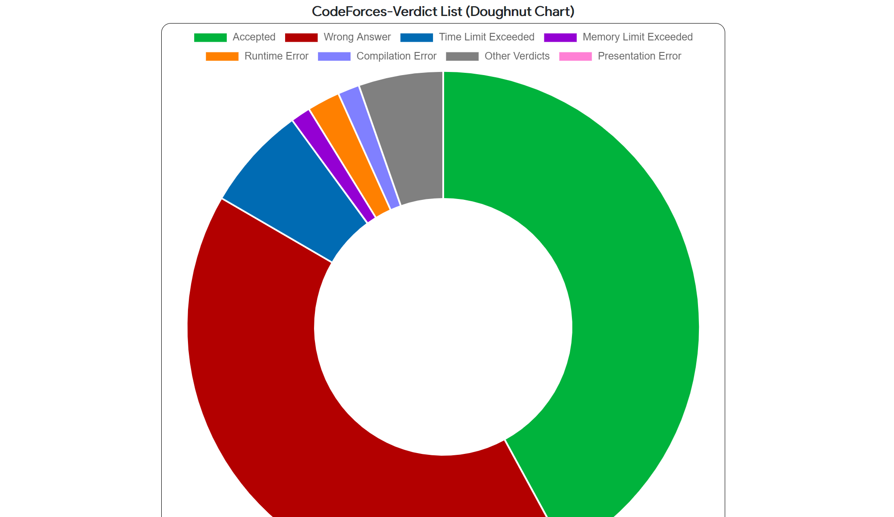

# CpZen
CpZen is an Online Integrated Development Environment (IDE) for competitive programmers made as the Lab project for CSE 4510: Software Development Lab.


## Built With:
### Frameworks and Dependencies: 
 
 


### APIs:
* [JDoodle](https://www.jdoodle.com/compiler-api/)
* [CLIST](https://clist.by/api/v1/doc/)
* [Codeforces API](https://codeforces.com/apiHelp)
* [uHunt API](https://uhunt.onlinejudge.org/api)
* [Kenkoooo's API for AtCoder](https://github.com/kenkoooo/AtCoderProblems/blob/master/doc/api.md)
### IDE: 

### Testing Tool: 

## Team Members:
* Syed Rifat Raiyan- 180041205
* Ishrak Hossain- 180041218
* Md. Maksudul Haque- 180041222

## Foreword:
The main goal of this application is to alleviate some of the tedious jobs a competitive programmer has to do on a regular basis by integrating them in a single place.

## Installation:
* Step-1: Make sure Python 3.7+ 64-bit is configured in your PC.
* Step-2: Open powershell, and install the required packages and dependencies by running: 
```shell
pip install -r requirements.txt
```
* Step-3: Run run.py with the command: 
```shell
python run.py
```
* Step-4: The application will be up and running on ```http://127.0.0.1:5000/```

## Features:
### Landing Page (pre-Login):


### Login/Signup:
Users can create a new account or login to an already existing account. If they forget their password, then a "Reset Password" link will be sent to their email.


### Landing Page (post-Login):
Text editor area with Syntax Highlighting, Auto-Indentation, Auto-Brackets Matching, Auto-Brackets Highlighting and Line Highlighting. Supports a total of 20 programming languages.\


\


### Compile/Run Code:
Users can click on Compile(Alt+C) to compile their code and on Run(Alt+R) to run their code. The source code, Standard Input and Standard Output (along with Build Log, Time taken and Memory usage) will be shown.


### Save Codes:
Users can save their code by clicking on Save(Alt+S) after providing a name for the file. They can click on "Copy" to copy the contents to clipboard or on "Download" to download the file to the local machine.


### Save Templates:
Ditto.


### Upcoming Contests:
Users can view a list of upcoming contests on 12 of the most popular online judges. The contests are categorized based on topics and difficulty levels and each list consists of the Contest Title, Contest Link, Start Time, End Time and Duration.


### Profile Statistics:
Users can view profile stats from 5 of the most popular online judges after selecting one of them and providing a judge handle/username. Stats include Contest Rating Line-graph, Submission Verdicts Doughnut-graph, Submission Activity Heatmap/Matrix-chart and list of Unsolved problems for up-solving.





### Algorithms:
Users can keep track of the algorithms they learn throughout their competitive programming journey by saving any good resources/problems pertaining to an algorithm they can find along with their subjective proficiency in the algorithm. They can choose to update any entry if they come across any new resource/problem or if they feel their proficiency in the algorithm has improved. They can also delete any algorithm entry. Users can have a slght idea about the algorithmic topics they have/don't have a grasp over by viewing the Proficiency Radar-chart and practise accordingly.


## Resources:
### Tutorials:
* [Chart.js Tutorial](https://www.youtube.com/watch?v=NySBh_DIRlg)
* [Highlight.js Tutorial](https://www.youtube.com/watch?v=y-0jqM9EeVM)
* [Flask Tutorial](https://www.youtube.com/watch?v=dam0GPOAvVI)

### Inspirations:
We were inspired by similar projects like:
* [StopStalk](https://www.stopstalk.com/)
* [Codeforces Visualizer](https://cfviz.netlify.app/)
* [clist.by](https://clist.by/)
* [OnlineGDB IDE](https://www.onlinegdb.com/)


